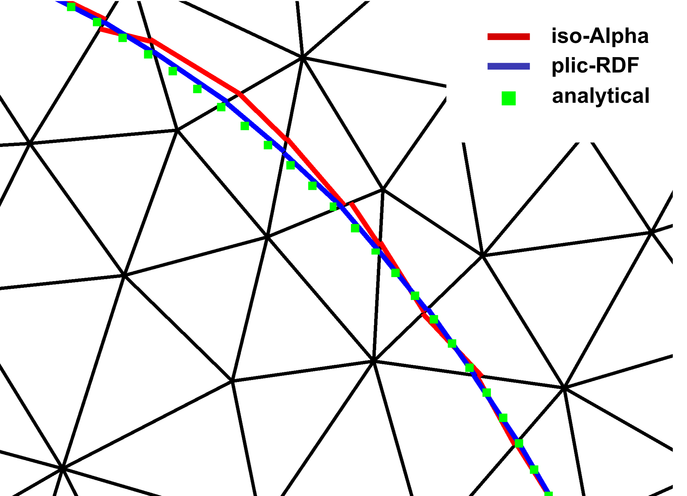
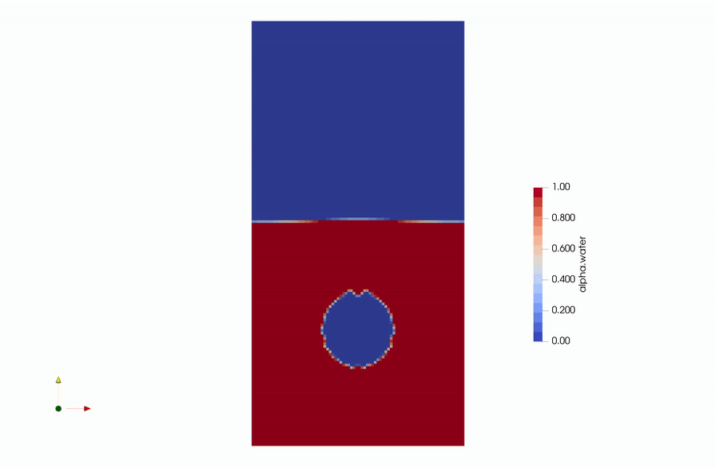
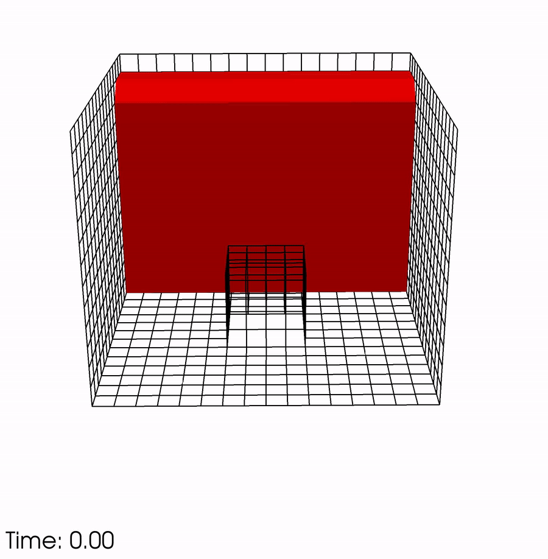
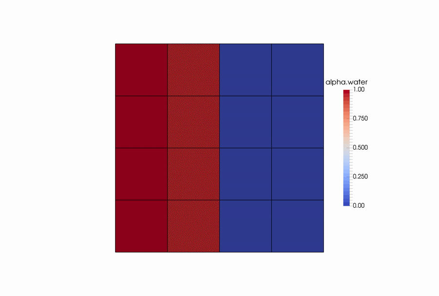
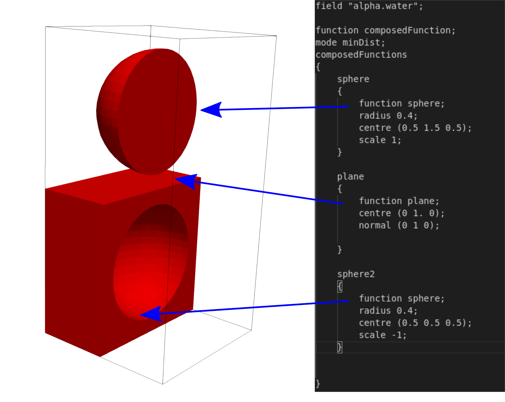

# VoFLibrary

The VoFLibrary provides multiple features around the geometric Volume of fluid Method - [isoAdvector](https://github.com/isoAdvector/isoAdvector).

Features:
* Multiple reconstruction schemes (isoAlpha, plicRDF, isoRDF, gradAlpha)
* Compressible formulation of the isoAdvector method (compressibleInterFlow)
* Tools for the initialization of multiple surfaces (initAlphaField)
* An improved alpha interpolation scheme for adaptive mesh refinement
* A post processing function for PLIC interfaces based on the sampledSurfaces

The core part of the Library is a newly develop reconstruction scheme enabling more accurate simulation on unstructured grids. Details about the method can be found in:

Henning Scheufler and Johan Roenby. "Accurate and efficient surface reconstruction from volume fraction data on general meshes." Journal of Computational Physics (2019), doi: 10.1016/j.jcp.2019.01.009.

## Installation:

For now the Library is only tested with OpenFOAM v1812 from www.openfoam.com. The compilation is execute by running the Allwmake script:

./Allwmake

## More accurate surface reconstruction

The geometrical VoF method, [isoAdvector](https://github.com/isoAdvector/isoAdvector), is a significant improvement compared to the standard interface compression scheme implemented in OpenFOAM. However, on unstructured grids the reconstruction step in isoAdvector, here named isoAlpha, shows much worse accuracy than on structured grids. The newly developed method, plicRDF, improves the normal orientation, especially on unstructured grids. A comparison of the two methods can be seen below:

The VoFLibrary offers runtime mechanism for selecting a reconstruction scheme so the user can switch between reconstruction methods by changing a keyword in the case setup file.

## Compressible Formulation

One of the major improvement which is not mentioned in the paper is the compressible extension of the isoAdvector method. Also here one can choose between the different reconstruction schemes. A small demonstration can be seen below:

This enables the geometric VoF for compressible solvers (compressibleInterFoam) giving a significantly more accurate representation of the interface compared to the standard volume of fluid scheme.

## Automatic mesh refinement

Both the compressibleInterFlow and the interFlow solver work with AMR as demonstrated below:

An illustration of the new alpha interpolation scheme is shown below: 

Instead of assuming that child cells have alpha value identical to the parent cell, we take the PLIC interface into account and distribute the alpha field accordingly. The correct positioning of the PLIC interface in the parent cell ensures correct fluid volume conservation.

## Initialisation of the alpha field

The utility initAlphaField allows for the initialization of the volume fraction field with the option of defining multiple fluid regions of different shape. Implicit functions are used to describe the shape of the regions, where positive function values correspond to fluid and negative values correspond to void. If a cell is intersected by the function the corresponding volume fraction is set in the cell. In order to initialize multiple regions the composedFunction has to be used which has multiple operation modes:

* add (e.g. to fuse two drops)
* subtract (e.g. to subtract a bubble from a planar surface)
* intersect (e.g. to intersect two bubbles)
* minDist (takes the closest implicit function, fails if the 0-isosurface of the two functions intersect in a cell)

The modes handle how the multiple implicit functions interact with one another. An example can be seen below:

